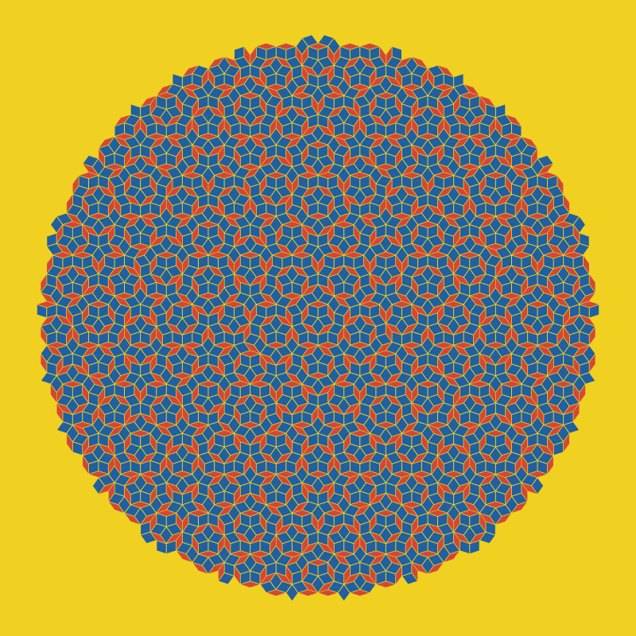
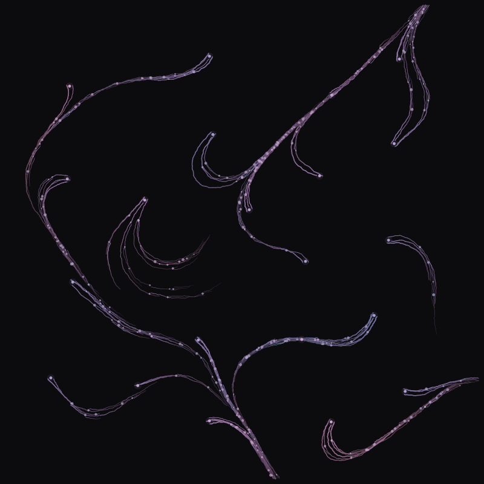

# genpuin

A Lua library for generative art. Scripts produce SVG or PPM output.
Supports Lua 5.1+ and Luajit.

<p>
  
  
</p>

The name is an acronym of "penguin" and an easy typo if you use the Colemak keyboard layout.

## Usage

You can use the library directly from Lua code or use the CLI to export image files.

```
$ lua bin/genpuin art.lua
$ lua bin/genpuin art.lua -o output.svg
$ lua bin/genpuin art.lua -o output.ppm -s 2 # optional raster scale parameter
```

Install the CLI with `make`.
Scripts used with the CLI should return a canvas. See `examples/` for full working examples.

```
$ sudo make install
$ genpuin art.lua
```

Generate all examples in this repo to `out/`:

```
$ make examples
```

## API

All functions are accessed through `require("genpuin")`.

- **Canvas:** `canvas` `background` `draw` `layer`
- **Geometry:** `line` `polyline` `polygon` `circle` `ellipse` `arc` `rect` `bezier` `spline` `compound`
- **Path ops:** `sampleAlong` `subdivide` `resample`
- **Color:** `rgb` `rgba` `hsv` `hsl` `hex` `lerpColor` `darken` `lighten` `withAlpha`
- **Gradients:** `linearGradient` `radialGradient`
- **Pen:** `pen`
- **Randomness:** `seed` `rand` `randRange` `randInt` `gaussian` `pick` `shuffle` `weightedPick` `randInCircle` `randOnCircle` `randInRect` `poissonDisk`
- **Patterns:** `grid` `radial` `scatter` `spiral` `alongPath` `subdivideRect` `kaleidoscope`
- **L-systems:** `rewrite`
- **Cellular automata:** `elementary` `evolve` `life`
- **Markov chains:** `markov` `markovFrom` `markovStep` `markovGenerate`
- **Noise & fields:** `perlin` `fbm` `noiseSeed` `flowField` `noiseField` `trace`
- **FX:** `jitter` `smooth` `taper` `stipple` `dash`
- **Transforms:** `translate` `rotate` `rotateAround` `scale` `scaleAround` `reflectX` `reflectY` `reflect`
- **Voronoi:** `voronoi` `relax`
- **Spatial:** `pointInPolygon` `nearest` `withinRadius` `packCircles` `separate`
- **Vec2:** `vec2` `vec2Add` `vec2Sub` `vec2Scale` `vec2Len` `vec2FromAngle` `vec2Dot` `vec2Lerp` `vec2Rotate`
- **Utilities:** `lerp` `mapRange` `clamp` `dist` `angle` `norm` `degrees` `radians`
- **Export:** `exportSvg` `exportPpm`

---

This library was written with AI assistance.
